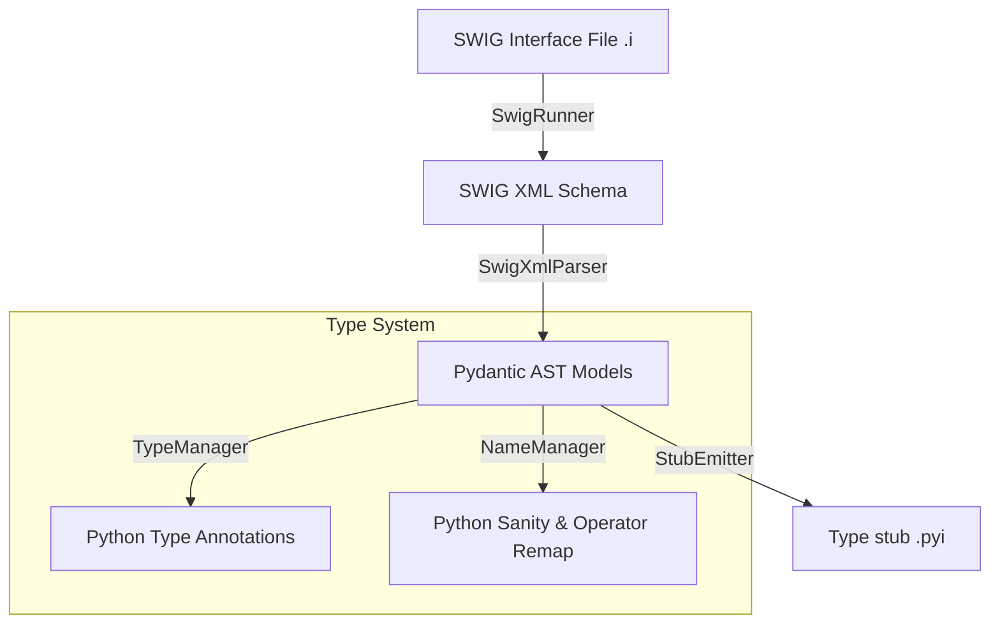

# Architecture & Technical Design: swig2pyi

This document defines the high-level architecture, module design, and translation conventions of `swig2pyi`.

---

## 1. Pipeline Architecture

`swig2pyi` is built as a direct-to-memory XML parsing pipeline. It avoids intermediate disk compilation or ORM database layers.

---

## 2. Key Components

### `SwigRunner` (in `runner.py`)
* **Purpose:** Runs the local `swig` compiler with `-xml` flag.
* **Caching:** Computes a SHA256 hash of SWIG versions, C++ source file modification times, and interface contents. Caches XML output in `.temp/swig_xml_cache/` to bypass compilation.

### `SwigXmlParser` (in `parser.py`)
* **Purpose:** Performs a single-pass parse of SWIG XML trees using standard `xml.etree.ElementTree`.
* **AST Mapping:** Constructs structured Pydantic models representing modules, classes, functions, enums, parameters, and variable definitions.

### `TypeManager` (in `type_system.py`)
* **Purpose:** Resolves C++ types to PEP 484 Python annotations.
* **Resolutions:**
  * Maps primitive types (e.g. `double` to `float`, `std::string` to `str`).
  * Resolves templates (`Handle<T>` becomes `Handle[T]`).
  * Relaxes container type signatures (e.g. methods accepting `std::vector<double>` accept `Union[RealVector, Sequence[float]]`).

### `NameManager` (in `naming.py`)
* **Purpose:** Map C++ identifiers and structures to Python naming guidelines.
* **Operators:** Translates C++ operators (e.g. `operator==`, `operator[]`) to Python dunder equivalents (`__eq__`, `__getitem__`).

### `StubEmitter` (in `emitter.py`)
* **Purpose:** Aggregates AST metadata, structures namespaces, formats signatures, and emits clean, formatted `.pyi` type stub files.

---

## 3. C++ to Python Type Translation Rules

### Class Handles & Overloads
* C++ `Handle<T>` proxy classes represent smart-pointer proxies. The emitter detects handle classes and automatically delegates all overloaded methods of the underlying type `T` to the handle stub to allow seamless typing.

### Iterators & Sequences
* Classes exposing `__getitem__` automatically receive a synthesized `__iter__` method signature to pass strict `basedpyright` verification.
* Vector types (`std::vector<T>`) generate list helper constructors (`Iterable`, fill size/value) and standard list methods (`push_back`, `resize`, `clear`).

### Enums and Member Variables
* Public member variables are translated into Python property getter/setter signatures.
* Global and class-nested C++ Enums export their members to module-level scopes to match python-wrapped SWIG runtime bindings.
