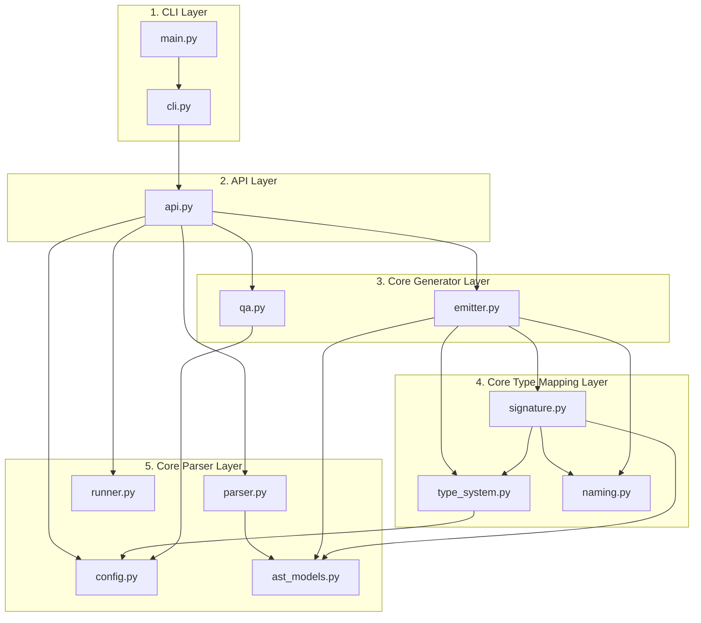

# Architecture

`swig2pyi` is structured as a decoupled compiler pipeline with strict architectural layers. We use [Tach](https://github.com/gauge-sh/tach) to declare and enforce boundaries between these modules, ensuring a linear, downward dependency graph with zero circular imports.

---

## The Compilation Pipeline

---

## Architectural Layers

The architecture of `swig2pyi` is divided into five logical tiers:

### 1. CLI Layer
* **Modules:** `main`, `cli`
* **Role:** Parses command-line flags, configures logs, sets up exceptions, and handles exit codes.
* **Constraints:** Must only depend on the public `api` layer. It is mathematically forbidden from importing from the `core` modules directly.

### 2. API Layer
* **Modules:** `api`
* **Role:** Orchestrates the high-level generation pipeline (e.g. `generate_from_interface`, `generate_from_xml`), wraps temporary XML generation, and exposes public API entrypoints.
* **Constraints:** Acts as the gateway between the CLI interface and compiler implementation.

### 3. Core Generator Layer
* **Modules:** `core.emitter`, `core.qa`
* **Role:**
    * **Emitter:** Traverses the parsed C++ AST representations and prints formatted Python type stub strings.
    * **QA:** Invokes external formatting/validation tools (like Ruff and Pyright) against stub outputs.
* **Constraints:** Depends on the semantic types layer to resolve individual types and parameters.

### 4. Core Type Mapping Layer
* **Modules:** `core.type_system`, `core.signature`, `core.naming`
* **Role:**
    * **Type System:** Translates C++ symbols, typedefs, smart pointers, and templates into clean Python PEP 484 type hints.
    * **Signature:** Formats function/method parameter lists, properties, and overloaded signatures.
    * **Naming:** Resolves operator remappings (like `operator==` to `__eq__`) and sanitizes Python keywords.
* **Constraints:** Depends on lower-level parser modules for base AST and configs.

### 5. Core Parser Layer
* **Modules:** `core.parser`, `core.runner`, `core.config`, `core.ast_models`
* **Role:**
    * **Parser:** Stream-parses massive SWIG XML inputs using `iterparse` into strongly typed AST elements.
    * **Runner:** Invokes the local SWIG compiler via subprocess, producing XML output. Stateless with no caching layer.
    * **Config / AST:** Defines base rules schema and target types.
* **Constraints:** Completely decoupled from generator and type resolution systems (leaf layer).
